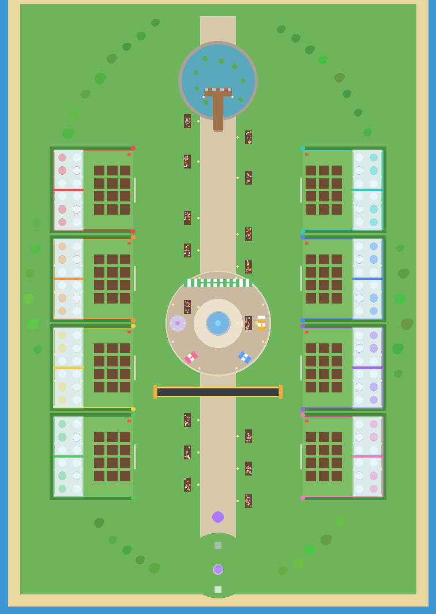

# Sproutling Isles (Roblox)

A grow-and-snatch simulator. Plant seeds, hatch Sproutlings (plant-creatures that earn Dew
every second), guard your greenhouse gate, and steal rare Sproutlings from your neighbours.
The full game design doc lives in Claude Docs (linked from the PR/session); this folder is the playable build.



## Open it in Roblox Studio

**Quickest:** open `build/SproutlingIsles.rbxlx` in Studio (File > Open from File). The map is
already baked in, and all scripts are in place. Press **Play**.

**Live-sync while editing code (recommended for development):**

```bash
# once: install Rojo (https://rojo.space) and the Rojo Studio plugin
rojo serve            # from this folder
```

In Studio open the baked place, then click **Connect** in the Rojo plugin. Code edits in `src/`
sync instantly.

### Rebuild the place file

```bash
rojo build -o build/SproutlingIsles.rbxlx
lune run tools/bake-map build/SproutlingIsles.rbxlx   # bakes the map so it's visible in edit mode
```

Without Lune you can bake from Studio's command bar instead:
`require(game.ReplicatedStorage.Shared.MapBuilder).Build(workspace)`. The server also builds
the map at runtime if `Workspace.Map` is missing.

## Before publishing

1. **Game Settings > Security:** turn on *Enable Studio Access to API Services* (for saving).
2. **Game Settings > Places:** set **Max Players to 8** (one plot per player).
3. **Creator Dashboard:** create the 5 game passes and 8 developer products listed in
   `src/shared/Products.luau`, then paste their IDs into that file. Items with ID `0` show
   "Set ID" in the in-game store and can't be bought.
4. Set `Config.StudioTestPasses = true` in `src/shared/Config.luau` to try every pass perk while
   play-testing in Studio. Set it back to false before publishing.
5. Test snatching with **Test > Clients and Servers > 2 players**.

## Code map

| Path | What it does |
| --- | --- |
| `src/shared/Config.luau` | Every tunable: prices, timers, lock length, rebirth cost, daily rewards |
| `src/shared/Species.luau` | 13 Sproutling species (rarity, price, grow time, Dew/s, colours) |
| `src/shared/Weather.luau` | Weather types and the mutations they apply |
| `src/shared/Products.luau` | Robux game passes and developer products |
| `src/shared/MapBuilder.luau` | Builds the whole island from parts (runs in Studio, server and Lune) |
| `src/shared/SproutModel.luau` | Builds a Sproutling's look and computes its income |
| `src/server/init.server.luau` | Bootstrap, player lifecycle, income tick, autosave |
| `src/server/DataService.luau` | DataStore load/save with session locking |
| `src/server/PlotService.luau` | Plot claim, planting, hatching, pads, selling, gate lock |
| `src/server/SnatchService.luau` | Snatch, carry, bonk, return |
| `src/server/ShopService.luau` | Seed Shop restocks, Sell Stand, Pollen Parade belt |
| `src/server/WeatherService.luau` | Weather cycle, sky tint, mutation and size rolls |
| `src/server/PondService.luau` | Wishing Pond and Sky Well loot |
| `src/server/ProgressionService.luau` | Rebirth, daily streak, Sky Garden pads |
| `src/server/MonetizationService.luau` | Pass ownership and receipt processing |
| `src/client/init.client.luau` | HUD, seed hotbar, toasts, store, prompt visibility, weather FX |

## Lint

```bash
selene src tools   # uses roblox_min.yml (a minimal Roblox std that works offline)
```
