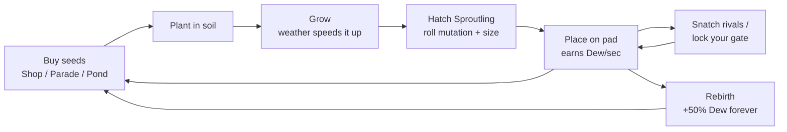

# Sproutling Isles — Game Design Doc

> Vault copy of the Claude Doc (link in `source` above). **This note is now the working copy.** Edit it here;
> the Claude Doc is an older snapshot. Back to [[Sproutling Isles]].

## Overview

Sproutling Isles is a grow-and-snatch simulator. Players plant seeds that hatch into Sproutlings, plant-creatures that earn Dew every second. Rival players can sneak in and carry them off.

**Pitch:** "Grow a garden of living plant-pets, guard your greenhouse, and steal the rare ones from your neighbours."

**Why this genre.** Collect/grow/idle games with a social twist were the top earners and player magnets of 2025–26 (Grow a Garden and its sequel, Steal a Brainrot, Fish It). Roblox's 2026 discovery changes reward return visits over 28 days, which this loop is built for (see Retention). Research: [[Roblox Market Research 2026]].

**Design pillars**

1. **One-minute loop.** Plant, wait, hatch and earn must be clear to a new player within 60 seconds on a phone.
2. **Always something growing.** Plants keep growing while you are offline, so every login has a reward waiting.
3. **Rare = shareable.** Weather mutations, huge sizes and Secret species create moments players clip and brag about.
4. **Risk makes it social.** Snatching gives low-stakes PvP. Your greenhouse lock is the reason to come back to your plot.
5. **Pay for time and flair, never for power over others.** Monetization speeds you up or looks cool. It never blocks or bullies other players.

**Audience.** The core is 9–17 year olds, mobile-first. A secondary target is 18+ "cozy collector" players, who spend more per head.

**Originality.** All species, names, currency, art direction and map are original. Only the genre conventions are shared with the reference games: plots, a restocking shop, a conveyor, a base lock and a fishing spot.

## Core loop

Every session repeats plant → grow → hatch → earn → spend, with snatching and defending layered on top. Rebirth is the long-term reset that multiplies everything.

The inner loop (buy, plant, hatch, earn) takes 30–90 seconds early on and stretches to 15–25 minutes at top tiers. The outer loops (snatching, rebirth) give reasons to stay after the garden is full.

**First five minutes (FTUE)**

1. Spawn on your own plot with 25 Dew and 2 free Mossbun seeds. An arrow points to the soil.
2. Plant both seeds. They hatch in 30 seconds and start earning 1 Dew/sec each.
3. A toast sends you to the Seed Shop. Buy a Pebblepup. The Pollen Parade belt runs right past you.
4. At about 3 minutes the first weather event, or a Parade rare, teaches mutations and rarity.
5. At about 5 minutes a notice says your new-player shield ends at 15 minutes, and shows where your gate lock button is.

## Systems

Thirteen species across seven rarities form the ladder. Each tier costs 3–4x more and takes longer to pay back, from 10 seconds for a Mossbun up to about 25 minutes for a Moonpetal Wisp. All values live in `Config.luau`, `Species.luau` and `Weather.luau`, so they can be tuned without touching code.

### Sproutlings

| Species | Rarity | Seed price (Dew) | Grow time | Dew/sec | Where to get it |
| --- | --- | --- | --- | --- | --- |
| Mossbun | Common | 10 | 30 s | 1 | Shop (always) |
| Pebblepup | Common | 40 | 45 s | 2 | Shop (always) |
| Clovercub | Common | 120 | 1 min | 4 | Shop 90% |
| Tulipaca | Uncommon | 500 | 1.5 min | 10 | Shop 70% |
| Cactoad | Uncommon | 1,500 | 2 min | 20 | Shop 55% |
| Mushroomph | Rare | 6,000 | 3 min | 50 | Shop 40% |
| Lilypadger | Rare | 18,000 | 4 min | 100 | Shop 30% |
| Thornix | Epic | 60,000 | 6 min | 220 | Shop 18% |
| Bloomingo | Epic | 180,000 | 8 min | 450 | Shop 12% |
| Sunfloof | Legendary | 600,000 | 10 min | 1,000 | Shop 6% |
| Orchidragon | Legendary | 2,000,000 | 15 min | 2,200 | Shop 3% |
| Moonpetal Wisp | Mythic | 7,500,000 | 25 min | 5,000 | Pollen Parade and Wishing Pond only |
| Starseed Sprite | Secret | 25,000,000 | 30 min | 12,000 | Parade and Pond at very low odds |

Every Sproutling is currently built from simple parts: a round body in the species colour, eyes, and a topper (leaf, petals, cap, spikes, lily pad, flame or crystal). The final art is described in [[Sproutling Isles - Art Brief]]. Size is rolled at hatch, from 0.8x to 1.5x, with a 1% chance of a **Huge** 2.5x. Size multiplies both income and sell value.

### Weather and mutations

Natural weather arrives every 5–8 minutes and lasts 2 minutes. Each Sproutling that hatches during weather rolls for that weather's mutation. A **Golden** roll (1%) can happen at any time.

| Weather | Odds (natural) | Growth speed | Mutation | Mutation chance | Multiplier |
| --- | --- | --- | --- | --- | --- |
| Drizzle | 50% | 2x | Dewy | 30% | x1.5 |
| Thunderbloom | 30% | 1.5x | Charged | 20% | x2 |
| Starfall | 15% | 1x | Starry | 15% | x3 |
| Aurora | 5% | 1.5x | Prismatic | 10% | x6 |
| (any) | — | — | Golden | 1% | x4 |

Starfall and Aurora can also be summoned for everyone with Robux. That is a public, generous purchase the whole server sees.

### Snatching and defence

- Any Sproutling on a rival's pad can be snatched while that rival's **gate is open**: hold the prompt for 1.5 s.
- The thief carries it over their head at walk speed 12 and has 45 s to reach their own plot. The server checks reach and speed to block teleport or speed hacks.
- The owner can **Bonk** the thief (press **R**) to send it straight back. It also returns if the thief times out, dies or leaves.
- **Gate lock:** the owner presses the lock button on their plot to close the gate for 60 s (90 s with Sturdy Gate). It only works while you stand on your plot, so defending means coming home.
- **Protections:** a 15-minute new-player shield, a 20 s cooldown between snatches, and plots of offline players disappear, so nobody loses progress while away.

### Other systems

- **Offline growth:** plants store a ready time, so seeds keep growing while you're offline. Sproutlings on pads earn only while you're online.
- **Seed Shop restock:** every 5 minutes on a shared clock, with stock rolled per player and a countdown on the shop sign.
- **Pollen Parade:** a conveyor where a seed crate appears every 6 s, first come first served. It's the only shop source of Mythic and Secret seeds.
- **Wishing Pond:** free to cast, 8 s cooldown. It pays mostly Dew or common seeds, with tiny odds of top-tier seeds.
- **Rebirth:** costs 250,000 Dew (x4 each time). It resets Dew, seeds and Sproutlings and adds +50% Dew permanently. From the first rebirth it also unlocks the Sky Garden well.
- **Daily streak:** a 7-day cycle of Dew and seeds that restarts if you miss 48 hours.
- **Trading (phase 2):** see [[Sproutling Isles - Trading Spec]].

## Map

One island about 480 x 720 studs. A central plaza sits on a north–south avenue with four player plots on each side, a fishing pond at the north tip, and a floating Sky Garden at the south. Every area borrows a proven layout idea from a hit game, with original art, names and rules.

![[sproutling-map-preview.png]]

*Top-down render of the map as built in the Studio project. North is up.*

| Area | Position (studs) | What's there | Layout reference | What we changed |
| --- | --- | --- | --- | --- |
| Bloom Plaza | Centre, radius 60 | Dewdrop Fountain spawn, Seed Shop market stall (north), Sell Stand (east), Rebirth Shrine (west), Daily Gift stall and Sprout Supply Robux kiosk | Grow a Garden's shared shop street; Adopt Me's cozy hub | A round plaza with physical kiosks. Each seed has its own stall with live stock on a sign, not a menu. |
| Player plots (8) | Two columns at x = ±155, 110 studs apart | 12 soil tiles (4x3), 8–12 display pads, greenhouse frame, gate with laser and lock button, owner sign | Grow a Garden's plot rows; Steal a Brainrot's bases with a lock | Plots combine a grow field and a display greenhouse. Gates face a shared avenue so raids are visible to everyone. |
| Pollen Parade | Belt from x = −70 to 70, just south of the plaza | Seed crates ride the belt for 32 s; first buyer wins | Steal a Brainrot's central conveyor | Sells seeds instead of characters, and is the only store for Mythic or Secret seeds. |
| Wishing Pond | North tip, radius 45 | Wooden dock with 4 cast spots, lanterns, lily pads | Fish It / Fisch docks | A one-button free cast for seed and Dew loot, with no minigame. A break from the busy plaza. |
| Sky Garden | Floating island, y = 90, south | Sky Well with better loot, a view over the island | Obby-style reward islands and VIP areas | Unlocked by rebirth, not Robux. A goal you can see from the ground. |
| Avenue and shore | Full length, x = −30 to 30 | Lamp posts, hedges, flower beds, sand shore, sea | — | Keeps travel between plot and plaza under 10 s, so defending is practical. |

**Readability rules.** Every interactive object has a floating label and a prompt. Plot colours run in a rainbow around the island, so "meet me at purple" works. Nothing important sits more than 250 studs from the plaza.

## Economy and monetization

One soft currency (Dew) and 13 Robux items. Summoned weather and income-scaled Dew packs are expected to earn the most. Nothing sold gives an advantage in snatching fights.

**Dew flow.** Dew comes in from pads (per second), the pond, daily gifts and selling. It goes out on seeds and rebirths. Multipliers stack: rebirth (+50% each) x 2x Dew pass x VIP (+10%) x mutation x size.

### Game passes (one-time)

| Pass | Price (R$) | Effect |
| --- | --- | --- |
| 2x Dew | 249 | Doubles all Dew income |
| Big Greenhouse | 199 | +4 display pads (8 → 12) |
| Lucky Rod | 149 | Doubles rare-catch weights at the Wishing Pond |
| VIP | 149 | Golden name tag, +10% Dew |
| Sturdy Gate | 99 | Gate lock 60 s → 90 s |

### Developer products (repeatable)

| Product | Price (R$) | Effect |
| --- | --- | --- |
| Summon Aurora | 399 | Server-wide Aurora (Prismatic x6 hatches); the buyer's name is announced |
| Dew Barrel | 249 | 3 hours of current income (min 20,000) |
| Summon Starfall | 199 | Server-wide Starfall (Starry x3 hatches) |
| Starter Pack | 49 | One-time: 2 Mushroomph seeds + 5,000 Dew, offered at 3 minutes |
| Luck Boost | 49 | 15 min of doubled mutation chance |
| Instant Grow | 39 | Finishes every seed in your soil |
| Dew Pouch | 29 | 15 min of current income (min 500) |
| Restock Shop | 25 | Re-rolls your seed stock now |

**Why these.** Server-wide weather is a public act of generosity: everyone benefits and sees your name, so it sells to the whole lobby at once. Dew packs scale with income, so they stay worth buying at every stage. The Starter Pack is priced to get the first purchase, since paying once makes a second purchase much more likely.

**Also planned:** rewarded video ads and Premium payouts (see [[Sproutling Isles - Launch & Live Ops]]).

### Revenue scenarios (monthly, illustrative)

Assumptions, to be replaced with real data after launch: daily users = 12x average concurrent players (CCU); monthly users = 4x daily users; 3% of monthly users pay, 500 R$ each; the creator keeps 70% of Robux, cashed out at $0.0038 per Robux.

| Scenario | Avg CCU | Paying users | Robux to creator | Payout (USD) |
| --- | --- | --- | --- | --- |
| Hit | 200,000 | 288,000 | 100.8M | ~$383,000 |
| Mid-tier | 20,000 | 28,800 | 10.1M | ~$38,000 |
| Small | 2,000 | 2,880 | 1.0M | ~$3,800 |

The 42% higher cash-out rate for US 18+ spending needs an R15 "novel" game. Sproutling Isles uses R15 but likely won't count as novel, so these figures leave that bonus out.

## Retention and live ops

Roblox's 2026 "Recommended For You" system scores games on day 1, days 2–7 and days 8–28. It looks at playtime, days played, playing with friends, days with a purchase, and Robux spent. Every system below targets at least one of those windows.

| Window | Signal Roblox measures | Feature that drives it |
| --- | --- | --- |
| Day 1 | First-play bounce, playtime | 30 s first hatch, 2 free seeds, first weather within ~5 min, Pollen Parade in sight at spawn |
| Days 2–7 | Play days | Offline growth (seeds ready at login), daily streak, 5-min shop restock timer |
| Days 8–28 | Play days, spend days | Rebirth ladder, weekly species drops, Secret hunting, limited-time weather |
| Any | Playing with friends | Snatch and defend, server-wide weather summons, plot colours as meeting points |

The detailed week 1–8 calendar, the Halloween event ("Hollow Harvest"), the beta plan and marketing are in [[Sproutling Isles - Launch & Live Ops]].

**Cadence.** Ship a small update every week on a fixed day and time, announced in-game with a countdown.

## Build status

See [[Sproutling Isles]] for live status and tasks, and [[Sproutling Isles - QA Review]] for the bug list and Studio test plan. In short: all core systems are coded, the QA blocker and major issues are fixed, and lint and build pass. **It hasn't been play-tested in Roblox Studio yet.**

**To publish:** enable API services; set Max Players to 8; create the 13 Robux items and paste their IDs; replace the placeholder art.

## Roadmap and KPIs

About 6 weeks to launch: Studio play-test and art pass, then a closed beta, then public launch with weekly updates. The go/no-go gate is day-1 retention of at least 30% in the beta.

| Phase | Weeks | Goal | Exit criteria |
| --- | --- | --- | --- |
| 0. Play-test and fix | 1 | Core loop bug-free with 2–8 players | No script errors in a 30-min, 8-player session |
| 1. Art and feel | 2–3 | Modelled Sproutlings, hatch animation, sounds, thumbnail and icon | Thumbnail click-through at or above the genre average |
| 2. Closed beta | 4 | Tune the economy from real data | D1 ≥ 30%, average session ≥ 15 min |
| 3. Launch | 5–6 | Public release plus sponsored ads | D7 ≥ 10%, payer conversion ≥ 2% |
| 4. Live ops | 6+ | Trading, events, leaderboards | D30 ≥ 4%, weekly CCU growth |

**KPIs to watch weekly:** first-play bounce rate; D1, D7 and D30 retention; average session length; share of players who hatch a mutation in session 1; payer conversion and revenue per daily user; Robux split (summons vs. Dew packs vs. passes); snatch rate per session and complaints about it (fairness check).

## Sources

- [Roblox – Optimizing Discovery (June 2026)](https://about.roblox.com/newsroom/2026/06/optimizing-discovery-great-games-reach-millions-players-roblox)
- [Roblox DevForum – Recommended For You retention update](https://devforum.roblox.com/t/recommended-for-you-algorithm-improvements-that-better-value-long-term-retention/4684575)
- [Roblox – 42% DevEx increase for 18+ spend](https://about.roblox.com/newsroom/2026/04/roblox-fuels-high-fidelity-games-over-18-players-increases-qualifying-devex-rate-42)
- [Gaming Amigos – Roblox Q2 2026 results](https://www.gamingamigos.com/post/roblox-q2-2026-results)
- [Dexerto – creator earnings 2026](https://www.dexerto.com/roblox/robloxs-top-creators-average-65-7-million-a-year-but-most-make-far-less-3408675/)
- [GAMES.GG – Grow a Garden 2](https://games.gg/news/grow-a-garden-2-release-date/)
- [MaxPower – Fish It](https://www.maxpowergaming.co/post/fish-it-how-a-simplified-copycat-became-one-of-roblox-s-biggest-hits)
- [Roblox Creator Hub – Monetization](https://create.roblox.com/docs/production/monetization)

Most of these pages were blocked from the research environment, so the figures come from search summaries. Check key numbers before quoting them publicly.
